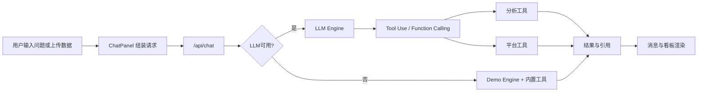

# AdPilot AI 项目文档

## 1. 项目简介

`AdPilot AI` 是一个面向广告投放场景的智能策略助手，目标是让用户通过自然语言完成数据分析与投放决策，并通过 Tool Use（函数调用）机制降低大模型幻觉风险。

项目定位：
- 面向运营与投放人员的「数据分析 + 策略建议 + 平台操作」一体化工作台
- 在 Demo 模式下可零配置体验，在 LLM 模式下可接入真实模型能力
- 支持广告平台数据回流与计划管理，减少多平台切换成本

## 2. 核心功能简介

### 2.1 数据导入与看板
- 支持上传 `CSV/JSON` 投放数据
- 支持一键加载示例数据（无 Key 可体验）
- 自动展示渠道指标与趋势看板（如 CPA、ROI、CTR、CVR）

### 2.2 智能对话分析
- 用户可直接提问投放问题（例如预算分配、异常检测、渠道对比）
- 系统通过工具函数执行精确计算，再由模型进行解释与表达
- 回答附带工具调用与数据来源，便于复核

### 2.3 Demo / LLM 双模式
- `Demo 模式`：未配置可用 LLM Key 时，使用内置规则与工具进行分析演示
- `LLM 模式`：接入真实模型进行对话与策略输出
- 模式由后端根据运行时配置自动判断

### 2.4 BYOK（用户自带 API Key）
- 网页端提供「大模型（BYOK）」配置面板，可填写：
  - API Key
  - API Base URL（可选）
  - 模型名（可选）
- Key 默认仅保存在用户本机浏览器（`localStorage`）
- 请求经本站服务端转发到模型 API

### 2.5 广告平台接入与计划管理
- 已接入平台：巨量引擎、磁力引擎、腾讯广告
- 支持 OAuth / Token 方式连接
- 可在对话中触发平台工具能力：
  - 同步报表数据
  - 查询广告计划
  - 创建/修改广告计划（预算相关操作需确认）

## 3. 技术路线

### 3.1 技术栈
- 前端：`Next.js 15` + `React 18` + `Tailwind CSS` + `Framer Motion`
- 图表：`Recharts`
- 数据解析：`PapaParse`
- LLM SDK：`openai`（兼容 OpenAI 协议生态）
- 部署：`Vercel`（主推荐） / `Cloudflare Workers`（OpenNext）

### 3.2 架构设计思路
- 使用 Next.js App Router 实现前后端一体化
- 后端通过 Route Handlers 暴露 API（`/api/chat`、`/api/platforms/*`）
- LLM 只负责理解与生成，数值计算由代码工具执行
- 广告平台采用统一连接器抽象，降低多平台扩展复杂度

### 3.3 关键数据流

## 4. 部署与访问网址

### 4.1 当前访问入口
- 生产域名：`https://www.leadwit.top`
- Vercel 默认域名：`https://leadwit-9xeg.vercel.app`
- 本地开发：`http://localhost:3000`

### 4.2 部署路线
- 方案 A（推荐）：GitHub + Vercel + 自定义域名
  - 代码推送到 `main` 后自动构建部署
  - 在 Vercel 绑定业务域名，并在 DNS 服务商配置解析
- 方案 B：Cloudflare Workers（OpenNext）
  - 通过 `opennextjs-cloudflare` + `wrangler` 发布
  - 可选绑定 `CUSTOM_WORKER_HOST` 自定义域名

## 5. 环境变量与配置说明

以 `.env.local.example` 为准，按需配置：

### 5.1 LLM 相关
- `OPENAI_API_KEY`
- `OPENAI_BASE_URL`（可选）
- `OPENAI_MODEL`（可选）

兼容场景包括 OpenAI、DeepSeek、智谱及其他 OpenAI 协议兼容服务。

### 5.2 广告平台 OAuth（可选）
- 巨量引擎：`OCEAN_ENGINE_APP_ID`、`OCEAN_ENGINE_SECRET`
- 磁力引擎：`KUAISHOU_APP_ID`、`KUAISHOU_SECRET`
- 腾讯广告：`TENCENT_ADS_CLIENT_ID`、`TENCENT_ADS_SECRET`

### 5.3 Cloudflare 自定义域名（可选）
- `CUSTOM_WORKER_HOST`

## 6. 目录与关键模块说明

- 页面与布局：`src/app/page.tsx`、`src/app/layout.tsx`
- 对话 API：`src/app/api/chat/route.ts`
- LLM 引擎：`src/lib/llm-engine.ts`
- Demo 引擎：`src/lib/demo-engine.ts`
- 平台工具：`src/lib/platform-tools.ts`
- 平台连接器：`src/lib/platforms/*`
- BYOK 面板：`src/components/LlmSettingsPanel.tsx`

## 7. 后续扩展建议

- 新增模型供应商：优先走 OpenAI 兼容协议，复用现有配置结构
- 新增广告平台：在 `src/lib/platforms` 下实现连接器并注册到索引
- 增强审计能力：补充平台操作日志与预算变更确认链路
- 面向团队协作：引入账号体系与配置隔离（按组织或项目）

